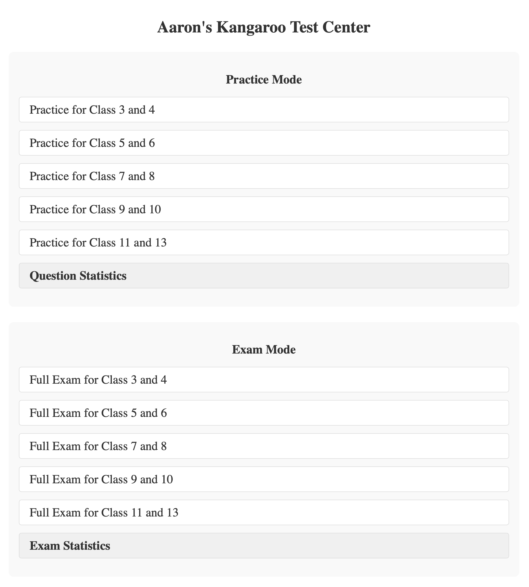
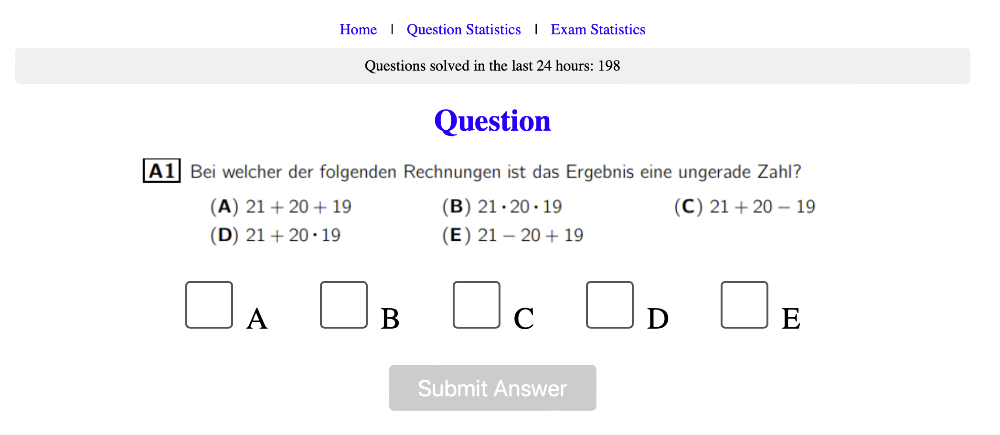
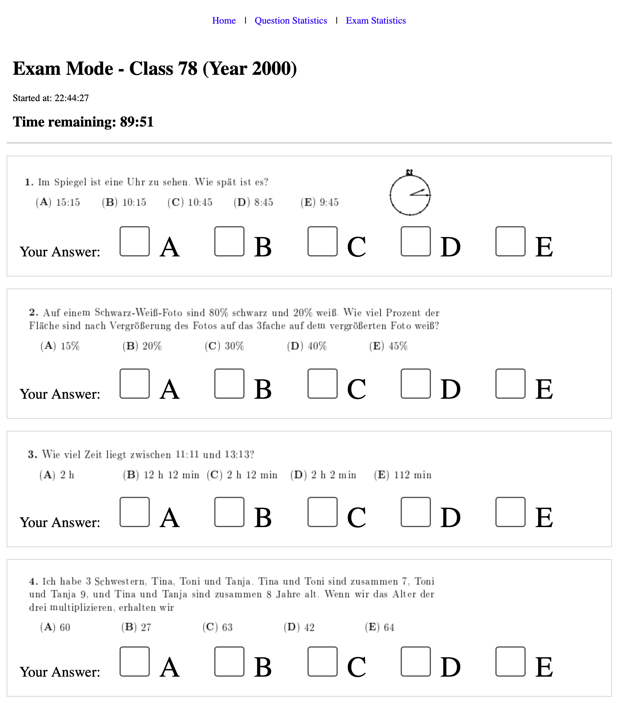

# quiz app for kangaroo math

Questions and answers for the kangaraoo math (Känguru der Mathematik) in
german, english and french. Sorted by year and classes.

## Screenshots

Here are some example screenshots of the application:

### Index Page

### Question Display

### Exam View

## Disclaimer

The question and answers were taken from https://www.mathe-kaenguru.de.
I assume commercial usage of these data is not encouraged/allowed.